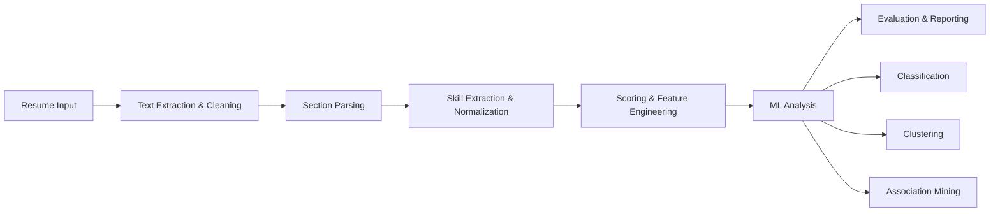
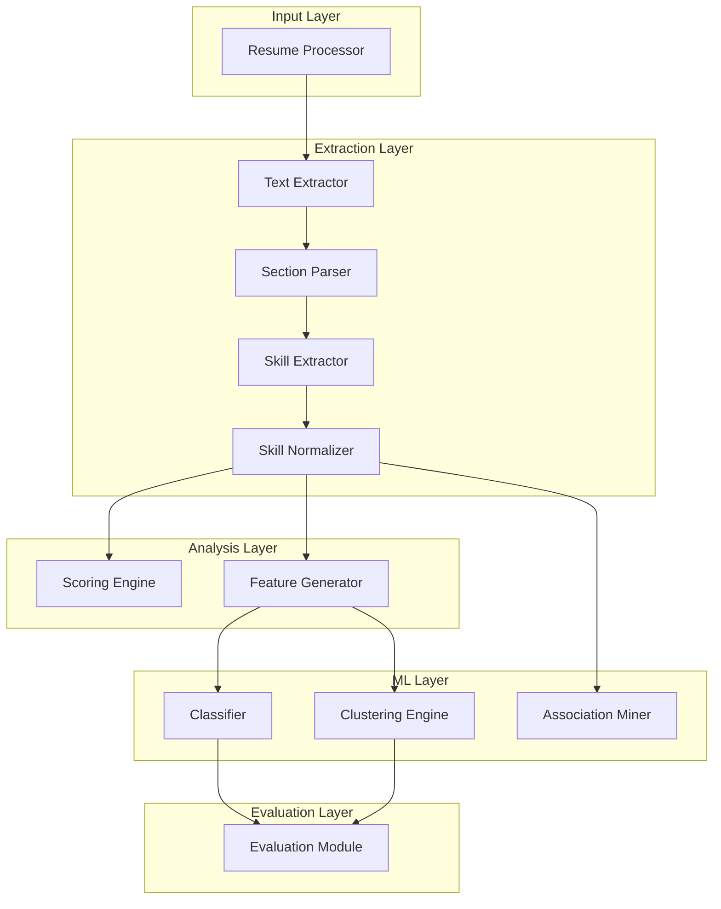

# Design Document: Smart Resume Screening System

## Overview

The Smart Resume Screening System is an intelligent NLP-powered pipeline that processes resumes to extract, normalize, and analyze candidate information. The system goes beyond traditional keyword-based ATS by incorporating semantic understanding, machine learning classification, clustering analysis, and skill association mining.

### System Goals

- **Automated Information Extraction**: Parse resumes to extract structured data including skills, experience, education, and projects
- **Semantic Understanding**: Calculate semantic similarity scores using transformer-based embeddings to identify conceptually related skills
- **Intelligent Classification**: Predict job categories using machine learning models trained on skill features
- **Pattern Discovery**: Identify skill clusters and association rules to understand talent market trends
- **Fairness and Transparency**: Evaluate model performance across job categories to detect and mitigate bias

### Key Capabilities

1. Multi-format resume processing (PDF, text)
2. NLP-based skill extraction (explicit and implicit)
3. Fuzzy matching for skill normalization
4. Dual scoring system (ATS + semantic)
5. ML-based job category classification
6. K-Means clustering for candidate grouping
7. Apriori algorithm for skill association mining
8. Comprehensive fairness analysis

## Architecture

### High-Level Architecture

The system follows a pipeline architecture with six main stages:



### Component Architecture



### Technology Stack

**Core Language**: Python 3.9+

**PDF Processing**:
- `pdfplumber` (primary) - Superior text extraction with layout analysis
- `pypdf` (fallback) - Lightweight alternative for simple PDFs

**NLP & Language Models**:
- `spaCy` 3.x - NER for skill extraction, tokenization, text processing
- `sentence-transformers` - Semantic embeddings (model: `all-MiniLM-L6-v2`)
- Pre-trained NER model: `en_core_web_sm` or custom-trained skill extraction model

**String Matching**:
- `RapidFuzz` - High-performance fuzzy string matching for skill normalization

**Machine Learning**:
- `scikit-learn` - Classification (Logistic Regression, Random Forest), clustering (K-Means), TF-IDF
- `mlxtend` - Apriori algorithm for association rule mining

**Data Processing**:
- `pandas` - Data manipulation and structured data handling
- `numpy` - Numerical operations and feature vectors

**Utilities**:
- `json` - Structured data serialization
- `re` - Regular expressions for text cleaning
- `pathlib` - File system operations

## Components and Interfaces

### 1. Resume Processor

**Responsibility**: Orchestrate the entire resume processing pipeline

**Interface**:
```python
class ResumeProcessor:
    def __init__(self, config: ProcessorConfig):
        """Initialize processor with configuration"""
        
    def process_resume(self, file_path: str) -> StructuredResume:
        """Process a single resume file"""
        
    def process_batch(self, directory: str) -> List[StructuredResume]:
        """Process all resumes in a directory organized by job categories"""
        
    def load_from_archive(self, archive_path: str) -> Dict[str, List[StructuredResume]]:
        """Load resumes from archive organized by job category folders"""
```

**Dependencies**: TextExtractor, SectionParser, SkillExtractor, SkillNormalizer, ScoringEngine

### 2. Text Extractor

**Responsibility**: Convert PDF resumes to clean plain text

**Interface**:
```python
class TextExtractor:
    def extract_from_pdf(self, pdf_path: str) -> str:
        """Extract text from PDF using pdfplumber"""
        
    def extract_from_text(self, text_path: str) -> str:
        """Load text from plain text file"""
        
    def clean_text(self, raw_text: str) -> str:
        """Remove special characters, normalize whitespace"""
        
    def validate_format(self, file_path: str) -> bool:
        """Check if file format is supported"""
```

**Implementation Details**:
- Use `pdfplumber.open()` for PDF extraction with layout preservation
- Fallback to `pypdf.PdfReader()` if pdfplumber fails
- Regex-based cleaning: remove non-alphanumeric except standard punctuation
- Whitespace normalization: collapse multiple spaces, normalize line breaks

### 3. Section Parser

**Responsibility**: Divide resume text into logical sections

**Interface**:
```python
class SectionParser:
    def __init__(self, section_patterns: Dict[str, List[str]]):
        """Initialize with regex patterns for section headers"""
        
    def parse_sections(self, text: str) -> ResumeSections:
        """Identify and extract all resume sections"""
        
    def extract_section(self, text: str, section_name: str) -> str:
        """Extract a specific section by name"""
```

**Section Detection Strategy**:
- Pattern-based matching using common section headers
- Case-insensitive regex patterns:
  - Skills: `r"(?i)(skills?|technical skills?|core competencies)"`
  - Experience: `r"(?i)(experience|work history|employment)"`
  - Education: `r"(?i)(education|academic background|qualifications)"`
  - Projects: `r"(?i)(projects?|portfolio)"`
- Return empty string for undetected sections

**Data Structure**:
```python
@dataclass
class ResumeSections:
    skills: str
    experience: str
    education: str
    projects: str
    raw_text: str
```

### 4. Skill Extractor

**Responsibility**: Extract explicit and implicit skills using NLP

**Interface**:
```python
class SkillExtractor:
    def __init__(self, nlp_model: str = "en_core_web_sm"):
        """Initialize with spaCy NLP model"""
        
    def extract_explicit_skills(self, skills_section: str) -> List[str]:
        """Extract skills from Skills section"""
        
    def extract_implicit_skills(self, experience: str, projects: str) -> List[str]:
        """Infer skills from Experience and Projects sections"""
        
    def extract_all_skills(self, sections: ResumeSections) -> SkillSet:
        """Extract both explicit and implicit skills"""
```

**Extraction Strategy**:
- Load spaCy model with NER capabilities
- For explicit skills: tokenize Skills section, extract noun phrases and entities
- For implicit skills: analyze Experience/Projects using NER to identify technology mentions, tools, methodologies
- Filter extracted entities to keep only skill-related terms (using skill taxonomy or keyword list)
- Return separate lists for explicit vs implicit skills

**Data Structure**:
```python
@dataclass
class SkillSet:
    explicit_skills: List[str]
    implicit_skills: List[str]
    
    def all_skills(self) -> List[str]:
        return self.explicit_skills + self.implicit_skills
```

### 5. Skill Normalizer

**Responsibility**: Standardize skill variations to canonical forms

**Interface**:
```python
class SkillNormalizer:
    def __init__(self, alias_dict: Dict[str, str], fuzzy_threshold: int = 85):
        """Initialize with alias dictionary and fuzzy matching threshold"""
        
    def normalize_skill(self, skill: str) -> str:
        """Normalize a single skill to canonical form"""
        
    def normalize_skills(self, skills: List[str]) -> List[str]:
        """Normalize a list of skills"""
        
    def load_alias_dictionary(self, dict_path: str) -> Dict[str, str]:
        """Load skill alias mappings from file"""
```

**Normalization Strategy**:
1. **Exact Match**: Check if skill exists in alias dictionary, return canonical form
2. **Fuzzy Match**: If no exact match, use RapidFuzz to find closest canonical skill
   - Use `rapidfuzz.process.extractOne()` with threshold (default 85%)
   - Return best match if score >= threshold
3. **Fallback**: If no match found, return original skill in lowercase

**Alias Dictionary Format**:
```json
{
  "js": "JavaScript",
  "javascript": "JavaScript",
  "react.js": "React",
  "reactjs": "React",
  "ml": "Machine Learning",
  "machine-learning": "Machine Learning"
}
```

### 6. Scoring Engine

**Responsibility**: Calculate ATS and semantic similarity scores

**Interface**:
```python
class ScoringEngine:
    def __init__(self, embedding_model: str = "all-MiniLM-L6-v2"):
        """Initialize with sentence transformer model"""
        
    def calculate_ats_score(self, resume_skills: List[str], job_requirements: List[str]) -> float:
        """Calculate keyword match percentage (0-100)"""
        
    def calculate_semantic_score(self, resume_skills: List[str], job_requirements: List[str]) -> float:
        """Calculate cosine similarity using embeddings (0-1)"""
        
    def calculate_both_scores(self, resume_skills: List[str], job_requirements: List[str]) -> Scores:
        """Calculate both ATS and semantic scores"""
```

**ATS Score Calculation**:
```python
def calculate_ats_score(resume_skills, job_requirements):
    resume_set = set(skill.lower() for skill in resume_skills)
    job_set = set(req.lower() for req in job_requirements)
    matches = len(resume_set.intersection(job_set))
    total_required = len(job_set)
    return (matches / total_required * 100) if total_required > 0 else 0.0
```

**Semantic Score Calculation**:
```python
from sentence_transformers import SentenceTransformer
from sklearn.metrics.pairwise import cosine_similarity

def calculate_semantic_score(resume_skills, job_requirements):
    model = SentenceTransformer('all-MiniLM-L6-v2')
    resume_text = ", ".join(resume_skills)
    job_text = ", ".join(job_requirements)
    resume_embedding = model.encode([resume_text])
    job_embedding = model.encode([job_text])
    similarity = cosine_similarity(resume_embedding, job_embedding)[0][0]
    return float(similarity)
```

### 7. Feature Generator

**Responsibility**: Convert skills to numerical feature vectors for ML

**Interface**:
```python
class FeatureGenerator:
    def __init__(self):
        """Initialize feature generator"""
        
    def build_vocabulary(self, all_resumes: List[StructuredResume]) -> List[str]:
        """Create vocabulary of all unique skills across dataset"""
        
    def generate_feature_vector(self, skills: List[str], vocabulary: List[str]) -> np.ndarray:
        """Convert skills to binary feature vector"""
        
    def generate_feature_matrix(self, all_resumes: List[StructuredResume]) -> Tuple[np.ndarray, List[str]]:
        """Generate feature matrix for all resumes"""
```

**Feature Engineering Strategy**:
- Build vocabulary: collect all unique normalized skills from entire dataset
- Create binary vectors: for each resume, set feature[i] = 1 if vocabulary[i] in resume skills, else 0
- Return sparse matrix representation for efficiency with large vocabularies

### 8. Classifier

**Responsibility**: Predict job categories from resume features

**Interface**:
```python
class Classifier:
    def __init__(self):
        """Initialize classifier with baseline and proposed models"""
        
    def train_baseline(self, X_train: np.ndarray, y_train: np.ndarray):
        """Train TF-IDF + Logistic Regression baseline"""
        
    def train_proposed(self, X_train: np.ndarray, y_train: np.ndarray):
        """Train skill features + Random Forest proposed model"""
        
    def predict(self, X: np.ndarray, model_type: str = "proposed") -> np.ndarray:
        """Predict job categories"""
        
    def predict_proba(self, X: np.ndarray, model_type: str = "proposed") -> np.ndarray:
        """Predict job category probabilities"""
```

**Model Specifications**:

**Baseline Model**:
- Features: TF-IDF vectors from raw resume text
- Algorithm: Logistic Regression with L2 regularization
- Hyperparameters: `C=1.0, max_iter=1000, multi_class='multinomial'`

**Proposed Model**:
- Features: Binary skill feature vectors
- Algorithm: Random Forest Classifier
- Hyperparameters: `n_estimators=100, max_depth=20, min_samples_split=5, random_state=42`

### 9. Clustering Engine

**Responsibility**: Group similar candidates using K-Means

**Interface**:
```python
class ClusteringEngine:
    def __init__(self, n_clusters: int = 10):
        """Initialize with number of clusters"""
        
    def fit_clusters(self, X: np.ndarray) -> np.ndarray:
        """Apply K-Means clustering and return cluster labels"""
        
    def get_cluster_centroids(self) -> np.ndarray:
        """Return cluster centroids"""
        
    def get_cluster_profiles(self, vocabulary: List[str]) -> Dict[int, List[str]]:
        """Get top skills for each cluster"""
```

**Clustering Strategy**:
- Algorithm: K-Means with k=10 (configurable)
- Initialization: k-means++ for better convergence
- Distance metric: Euclidean distance on binary feature vectors
- Cluster profiling: identify top N skills with highest centroid values per cluster

### 10. Association Miner

**Responsibility**: Discover frequently co-occurring skills using Apriori

**Interface**:
```python
class AssociationMiner:
    def __init__(self, min_support: float = 0.1, min_confidence: float = 0.5):
        """Initialize with support and confidence thresholds"""
        
    def mine_frequent_itemsets(self, transactions: List[List[str]]) -> pd.DataFrame:
        """Find frequent skill sets using Apriori"""
        
    def generate_rules(self, frequent_itemsets: pd.DataFrame) -> pd.DataFrame:
        """Generate association rules with support, confidence, lift"""
        
    def mine_associations(self, all_resumes: List[StructuredResume]) -> AssociationResults:
        """Complete association mining pipeline"""
```

**Mining Strategy**:
- Transform resumes to transactions (each resume = list of skills)
- Use `mlxtend.frequent_patterns.apriori()` to find frequent itemsets
- Use `mlxtend.frequent_patterns.association_rules()` to generate rules
- Filter rules by minimum confidence threshold
- Calculate lift metric: `lift = confidence(A→B) / support(B)`

**Output Format**:
```python
@dataclass
class AssociationRule:
    antecedents: frozenset
    consequents: frozenset
    support: float
    confidence: float
    lift: float
```

### 11. Evaluation Module

**Responsibility**: Measure model performance and fairness

**Interface**:
```python
class EvaluationModule:
    def evaluate_classification(self, y_true: np.ndarray, y_pred: np.ndarray) -> ClassificationMetrics:
        """Calculate accuracy, macro-F1 for classification"""
        
    def evaluate_clustering(self, X: np.ndarray, labels: np.ndarray) -> ClusteringMetrics:
        """Calculate silhouette score for clustering"""
        
    def compare_models(self, baseline_metrics: ClassificationMetrics, 
                      proposed_metrics: ClassificationMetrics) -> ComparisonReport:
        """Compare baseline vs proposed model performance"""
        
    def analyze_fairness(self, y_true: np.ndarray, y_pred: np.ndarray, 
                        job_categories: List[str]) -> FairnessReport:
        """Analyze performance across job categories"""
```

**Metrics Calculation**:

**Classification Metrics**:
```python
from sklearn.metrics import accuracy_score, f1_score

def evaluate_classification(y_true, y_pred):
    accuracy = accuracy_score(y_true, y_pred)
    macro_f1 = f1_score(y_true, y_pred, average='macro')
    return ClassificationMetrics(accuracy=accuracy, macro_f1=macro_f1)
```

**Clustering Metrics**:
```python
from sklearn.metrics import silhouette_score

def evaluate_clustering(X, labels):
    score = silhouette_score(X, labels)
    return ClusteringMetrics(silhouette_score=score)
```

**Fairness Analysis**:
- Calculate per-category F1 scores
- Compute variance across categories
- Flag categories with F1 < (mean - std_dev)
- Report performance disparity metrics

## Data Models

### StructuredResume

Complete JSON representation of processed resume:

```python
@dataclass
class StructuredResume:
    resume_id: str
    job_category: str
    sections: ResumeSections
    skills: SkillSet
    normalized_skills: List[str]
    scores: Optional[Scores]
    metadata: ResumeMetadata
    
    def to_json(self) -> dict:
        """Convert to JSON-serializable dictionary"""
        
    @classmethod
    def from_json(cls, data: dict) -> 'StructuredResume':
        """Create from JSON dictionary"""
```

**JSON Schema**:
```json
{
  "resume_id": "string",
  "job_category": "string",
  "sections": {
    "skills": "string",
    "experience": "string",
    "education": "string",
    "projects": "string",
    "raw_text": "string"
  },
  "skills": {
    "explicit_skills": ["string"],
    "implicit_skills": ["string"]
  },
  "normalized_skills": ["string"],
  "scores": {
    "ats_score": "float",
    "semantic_score": "float"
  },
  "metadata": {
    "file_path": "string",
    "processed_date": "string",
    "processing_time_ms": "integer"
  }
}
```

### Configuration Models

```python
@dataclass
class ProcessorConfig:
    pdf_extractor: str = "pdfplumber"  # or "pypdf"
    nlp_model: str = "en_core_web_sm"
    embedding_model: str = "all-MiniLM-L6-v2"
    fuzzy_threshold: int = 85
    alias_dict_path: str = "config/skill_aliases.json"
    
@dataclass
class MLConfig:
    n_clusters: int = 10
    min_support: float = 0.1
    min_confidence: float = 0.5
    test_size: float = 0.2
    random_state: int = 42
```

## Error Handling

### Error Types and Handling Strategy

**1. File Processing Errors**:
- `FileNotFoundError`: Return error message with supported formats
- `PDFExtractionError`: Fallback to alternative extractor, log failure
- `UnsupportedFormatError`: Return clear error message listing supported formats

**2. NLP Processing Errors**:
- `ModelLoadError`: Fail fast with clear error message about missing models
- `SkillExtractionError`: Log warning, return empty skill list, continue processing
- `SectionParsingError`: Mark section as empty, continue with available sections

**3. Scoring Errors**:
- `EmptySkillSetError`: Return score of 0.0, log warning
- `EmbeddingError`: Fallback to ATS score only, log error

**4. ML Errors**:
- `InsufficientDataError`: Require minimum dataset size, raise clear error
- `ModelTrainingError`: Log detailed error, provide diagnostic information
- `PredictionError`: Return None, log error with resume ID

**Error Response Format**:
```python
@dataclass
class ProcessingError:
    error_type: str
    message: str
    resume_id: Optional[str]
    timestamp: str
    recoverable: bool
```

### Logging Strategy

- Use Python `logging` module with structured logging
- Log levels:
  - INFO: Successful processing, pipeline stages
  - WARNING: Recoverable errors, missing sections
  - ERROR: Processing failures, model errors
  - DEBUG: Detailed extraction results, intermediate values

## Testing Strategy

This system requires a comprehensive testing approach combining unit tests for specific components and integration tests for end-to-end validation.

### Unit Testing

**Test Coverage Areas**:

1. **Text Extraction Tests**:
   - Test PDF extraction with sample resumes
   - Test text cleaning with various special characters
   - Test format validation for supported/unsupported formats
   - Test fallback mechanism when primary extractor fails

2. **Section Parsing Tests**:
   - Test section detection with various header formats
   - Test handling of missing sections
   - Test case-insensitive pattern matching
   - Test section boundary detection

3. **Skill Extraction Tests**:
   - Test explicit skill extraction from Skills sections
   - Test implicit skill extraction from Experience/Projects
   - Test distinction between explicit and implicit skills
   - Test handling of empty sections

4. **Skill Normalization Tests**:
   - Test exact alias dictionary matches
   - Test fuzzy matching with various similarity thresholds
   - Test handling of skills not in dictionary
   - Test case normalization

5. **Scoring Tests**:
   - Test ATS score calculation with various skill overlaps
   - Test semantic score calculation with embeddings
   - Test handling of empty skill sets
   - Test score boundary conditions (0-100 for ATS, 0-1 for semantic)

6. **Feature Engineering Tests**:
   - Test vocabulary building from multiple resumes
   - Test binary vector generation
   - Test consistent dimensionality across resumes
   - Test handling of unseen skills

7. **Classification Tests**:
   - Test baseline model training and prediction
   - Test proposed model training and prediction
   - Test probability output format
   - Test handling of unknown categories

8. **Clustering Tests**:
   - Test K-Means clustering with various k values
   - Test centroid calculation
   - Test cluster profile generation
   - Test handling of edge cases (k > n_samples)

9. **Association Mining Tests**:
   - Test frequent itemset discovery
   - Test rule generation with support/confidence thresholds
   - Test lift calculation
   - Test handling of sparse transactions

10. **Evaluation Tests**:
    - Test accuracy and F1 score calculations
    - Test silhouette score calculation
    - Test fairness analysis across categories
    - Test variance calculation and flagging logic

### Integration Testing

**End-to-End Pipeline Tests**:
- Test complete resume processing from PDF to structured JSON
- Test batch processing of multiple resumes
- Test archive loading with job category organization
- Test ML pipeline from feature generation through evaluation

**Cross-Component Tests**:
- Test data flow between extraction and normalization
- Test feature generation feeding into classification
- Test evaluation module receiving predictions from classifier

### Test Data Requirements

- Sample resumes in PDF and text formats
- Resumes with various section formats and layouts
- Job requirement lists for scoring tests
- Pre-labeled dataset for classification validation
- Skill alias dictionary for normalization tests

### Testing Tools

- `pytest` - Test framework
- `pytest-cov` - Coverage reporting
- `unittest.mock` - Mocking external dependencies
- `hypothesis` - Property-based testing (not applicable for this system - see note below)

**Note on Property-Based Testing**: This system is **not suitable for property-based testing** because:
1. **External Dependencies**: Heavy reliance on external ML models (spaCy, sentence-transformers) and libraries whose behavior we don't control
2. **Non-Deterministic Components**: Fuzzy matching, clustering, and ML predictions are inherently non-deterministic
3. **Complex Domain Logic**: Resume parsing and skill extraction involve heuristics and domain-specific rules that don't have universal properties
4. **Integration-Heavy**: Most valuable tests are integration tests validating the pipeline, not pure functions with universal properties

Instead, focus on:
- Example-based unit tests with representative inputs
- Integration tests with real resume samples
- Regression tests to catch breaking changes
- Performance tests for large datasets

## Deployment Considerations

### System Requirements

**Minimum Requirements**:
- Python 3.9+
- 4GB RAM (for NLP models)
- 2GB disk space (for models and data)

**Recommended Requirements**:
- Python 3.10+
- 8GB RAM (for large datasets)
- 5GB disk space
- Multi-core CPU for parallel processing

### Installation

```bash
# Create virtual environment
python -m venv venv
source venv/bin/activate  # On Windows: venv\Scripts\activate

# Install dependencies
pip install pdfplumber pypdf spacy sentence-transformers rapidfuzz scikit-learn mlxtend pandas numpy

# Download spaCy model
python -m spacy download en_core_web_sm
```

### Configuration Files

**skill_aliases.json**: Skill normalization mappings
**config.yaml**: System configuration (thresholds, model paths, etc.)
**job_categories.json**: List of valid job categories

### Performance Optimization

- **Batch Processing**: Process multiple resumes in parallel using `multiprocessing`
- **Model Caching**: Load NLP models once and reuse across resumes
- **Feature Matrix Sparsity**: Use scipy sparse matrices for large vocabularies
- **Incremental Processing**: Support resume-by-resume processing for streaming scenarios

### Monitoring and Observability

- Log processing times per resume
- Track extraction success rates
- Monitor model prediction confidence distributions
- Alert on fairness metric violations

## Future Enhancements

1. **Advanced NER**: Fine-tune custom spaCy model on resume-specific skill entities
2. **Multi-Language Support**: Extend to non-English resumes
3. **Deep Learning Classification**: Experiment with transformer-based classifiers (BERT, RoBERTa)
4. **Active Learning**: Incorporate human feedback to improve skill extraction
5. **Real-Time API**: Deploy as REST API for integration with ATS systems
6. **Explainability**: Add SHAP/LIME for model prediction explanations
7. **Resume Generation**: Reverse pipeline to generate resume suggestions
8. **Skill Gap Analysis**: Compare candidate skills against job requirements with recommendations

---

**Document Version**: 1.0  
**Last Updated**: 2025  
**Status**: Ready for Implementation
